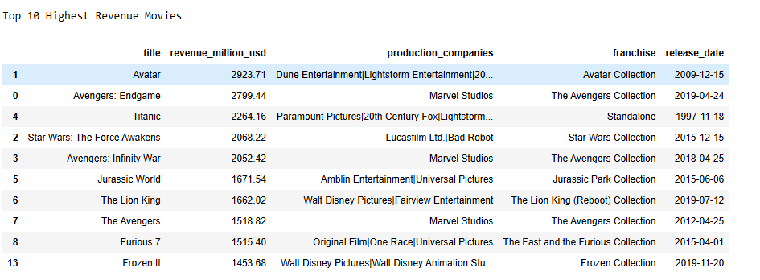
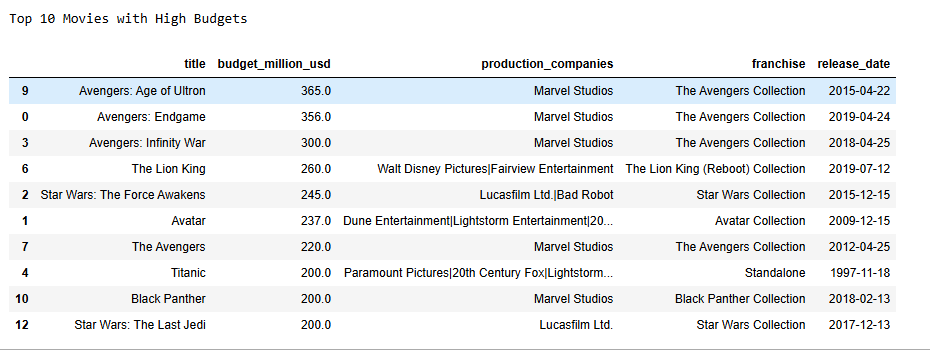
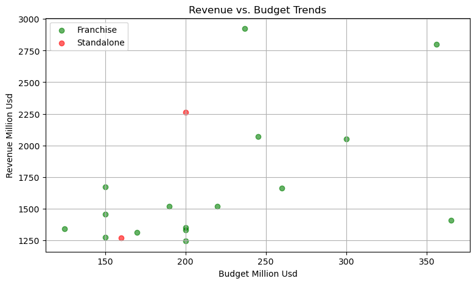
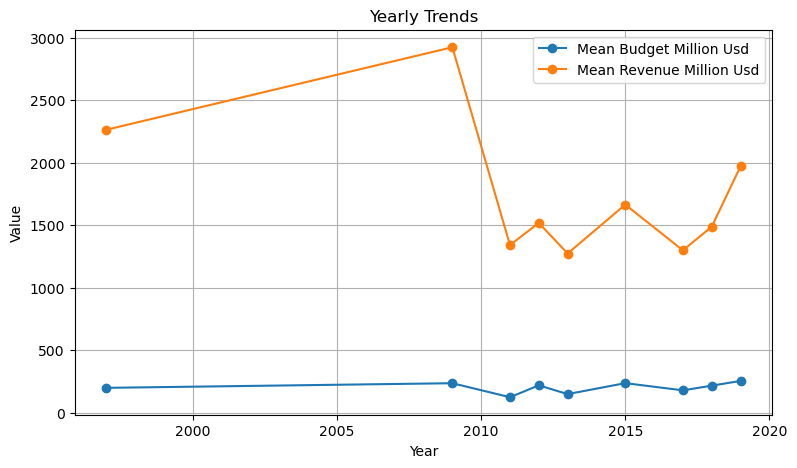

# 🎥 Movie Data Analysis Project

A data analysis project using movie data sourced from TMDB (The Movie Database). This project explores how movies have performed across several KPIs, uncovering trends related to budget, revenue, profit, and popularity.

---

## 📁 Contents

1. [Introduction](#introduction)  
2. [Methodology](#methodology)  
3. [Insights](#insights)  
4. [Conclusion](#conclusion)

---

## 📌 Introduction

This project is based on movie data retrieved from TMDB's API. The primary goal was to analyze key performance indicators (KPIs) and extract insights on how movies performed at the box office.

By transforming raw JSON data into a structured format, we explored various dimensions such as revenue, budgets, profits, and return on investment (ROI) to understand what makes a movie financially successful.

---

## 🛠️ Methodology

The project followed a step-by-step data analysis pipeline that included:

- **Data extraction** from TMDB’s API  
- **Cleaning and transforming** raw JSON data  
- **KPI computation** and deriving insights  
- **Data visualization** for storytelling

### 🔧 Tools Used:
- Python  
- Jupyter Notebook  
- Git & GitHub  

### 📦 Libraries Used:
- `pandas`  
- `ast`  
- `requests`  
- `matplotlib`  
- `os`

---

### 📥 STEP 1: API Data Extraction

TMDB returns data in JSON format with nested structures. Using the `requests` library, movie data was fetched using a list of IDs. Data was saved to CSV format after light validation and inspection.

---

### 🧹 STEP 2: Data Cleaning and Preprocessing

The raw dataset required multiple transformations:
- Dropped irrelevant columns  
- Parsed stringified JSON objects (e.g., cast, crew, genres)  
- Extracted key details for analysis such as director names, genre tags, and actor lists

---

## 📊 STEP 3: KPI Performance and Analysis

KPIs were analyzed to evaluate each movie’s success from both a business and audience perspective:

### 🎬 Top 3 Movies by Revenue

- **Avatar: Enter the World of Pandora**  
- **Avengers: Endgame**  
- **Titanic**

**📈 Chart: Top 10 Movies by Revenue**  

---

### 💸 Top 3 Movies by Budget

- **Avengers: Age of Ultron** – $365M  
- **Avengers: Endgame** – $356M  
- **Avengers: Infinity War** – $300M  

**📈 Chart: Top Movies by Budget**  

---

### 🤑 Highest Profit Movies

- **Avatar** – $2.6B  
- **Avengers: Endgame** – $2.4B  
- **Titanic** – $2B  

### 📉 Lowest Performing (Profit)

- **Avengers: Age of Ultron**  
- **Incredibles 2**  
- **Beauty and the Beast**  

**📈 Chart: Top vs. Bottom Profit Performers**  

---

### 📈 Best ROI (Return on Investment)

- **Avatar** – 12x  
- **Titanic** – 11x  
- **Jurassic World** – 11x  

### 📉 Worst ROI

- **Avengers: Age of Ultron** – 6x  
- **Incredibles 2** – 6x  
- **The Lion King** – 6x  

**📈 Chart: ROI Distribution**  

---

### 🗳️ Most Voted Movies

- **Avatar** – 32,119 votes  
- **The Avengers** – 31,000 votes  
- **Avengers: Infinity War** – 30,000 votes  

**📈 Chart: Vote Counts**  

---

## 🔍 Franchises vs. Standalone Movies

### 🎥 Franchise vs Standalone: Budget & Revenue

Franchise movies dominate both in terms of production budget and total box office revenue.

- Franchises such as *Avengers*, *Avatar*, and *Jurassic World* consistently had the highest budgets.
- These films benefit from existing audiences and perform well at the box office.

**📊 Bar Chart: Franchise vs Standalone Budget & Revenue**  

---

### 💰 Budget vs ROI: Does Spending More Pay Off?

High budgets don’t always mean high returns.

- *Avengers: Age of Ultron* had a massive budget (~$365M) but a relatively lower ROI (~3x).
- *Avatar* and *Titanic* stood out with ROIs over **10x**, showing cost-efficiency and widespread appeal.

**📈 Chart: Budget vs ROI**  

---

### 📈 Budget vs Revenue Correlation

This scatter plot illustrates the relationship between movie budgets and their generated revenue.

- There is a **positive correlation** between budget and revenue, but with **notable outliers**.
- Some lower-budget films performed surprisingly well.

**📉 Scatter Plot: Budget vs Revenue**  

---

### 📅 Yearly Trends in Box Office Performance

This shows how budget and revenue have changed over the years, helping identify shifts in production scale and market size.

**📈 Line Graph: Yearly Trends (Budget & Revenue)**  

---

## 🔑 Key Takeaways

- **Franchises** tend to bring big budgets and big returns, but not always proportionate ROIs.  
- High budget doesn’t guarantee a successful movie. Success depends on cost efficiency and strategic storytelling.  
- **Standalone films**, though riskier, can outperform when creatively executed, with effective stories and direction.  
- There is a positive correlation between budget and revenue, but ROI highlights the importance of profitability over sheer earnings.

---

## ✅ Conclusion

This project provided valuable insights into the movie industry through the lens of data.  
It identified financially successful and underperforming films, recognized the power of franchises, and uncovered trends tied to audience engagement.
