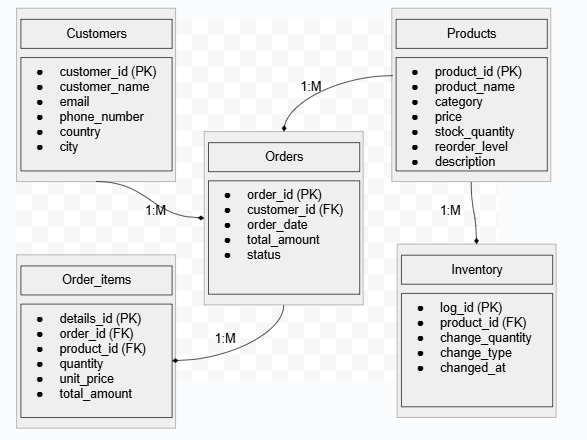

# 🗂️ Inventory Management Database

## 🔧 Tools Used

- **PostgreSQL** – Relational database used for storing and managing inventory data.
- **Docker** – Used to containerize and run PostgreSQL services locally.
- **pgAdmin (Desktop)** – GUI client for managing and querying the PostgreSQL database.
- **SQL** – For creating schema and performing database operations.

---

## 🧱 Database Schema Overview

This database is designed to manage a basic **inventory and order management system**. It includes information on customers, products, orders, inventory changes, and order details.

**Entity Relationships:**

- **Customers** place multiple **Orders**
- **Orders** contain multiple **Order Details**
- **Products** are referenced in both **Order Details** and **Inventory Logs**

---

## 🧮 Tables & Column Descriptions

### 1. `customers`

Stores customer information.

| Column         | Data Type     | Description                    |
|----------------|---------------|--------------------------------|
| customer_id    | SERIAL (PK)   | Unique identifier              |
| customer_name  | VARCHAR(100)  | Full name of the customer      |
| email          | VARCHAR(100)  | Email address                  |
| phone_number   | VARCHAR(20)   | Contact number                 |
| country        | VARCHAR(50)   | Country of residence           |
| city           | VARCHAR(50)   | City of residence              |

---

### 2. `products`

Stores product information.

| Column         | Data Type     | Description                          |
|----------------|---------------|--------------------------------------|
| product_id     | SERIAL (PK)   | Unique identifier                    |
| product_name   | VARCHAR(100)  | Name of the product                  |
| category       | VARCHAR(50)   | Product category          |
| price          | NUMERIC(10,2) | Price per unit                       |
| stock_quantity | INT           | Quantity currently in stock          |
| reorder_level  | INT           | Threshold to trigger reordering      |
| product_description    | TEXT          | Additional product description       |

---

### 3. `orders`

Stores order data and links to customers.

| Column         | Data Type     | Description                          |
|----------------|---------------|--------------------------------------|
| order_id       | SERIAL (PK)   | Unique identifier                    |
| customer_id    | INT (FK)      | Reference to `customers.customer_id` |
| order_date     | DATE          | Date of the order                    |
| total_amount   | NUMERIC(10,2) | Total order value                    |
| status         | VARCHAR(20)   | Status (e.g. pending, completed)     |

---

### 4. `order_details`

Details the individual details in an order.

| Column         | Data Type     | Description                           |
|----------------|---------------|---------------------------------------|
| details_id     | SERIAL (PK)   | Unique identifier                     |
| order_id       | INT (FK)      | Reference to `orders.order_id`        |
| product_id     | INT (FK)      | Reference to `products.product_id`    |
| quantity       | INT           | Number of units ordered               |
| unit_price     | NUMERIC(10,2) | Price per unit at time of order       |
| total_amount   | NUMERIC(10,2) | Total cost = quantity × unit_price    |

---

### 5. `inventory_logs`

Tracks stock changes such as restocks or sales.

| Column         | Data Type     | Description                              |
|----------------|---------------|------------------------------------------|
| log_id         | SERIAL (PK)   | Unique identifier                        |
| product_id     | INT (FK)      | Reference to `products.product_id`       |
| change_quantity| INT           | Number of items added or removed         |
| change_type    | VARCHAR(50)   | e.g. `restock`, `sale`, `return`         |
| changed_at     | TIMESTAMP     | When the inventory change occurred       |

---

## 🔗 Relationships

- **1 customer → M orders**
- **1 order → M order_details**
- **1 product → M order_details**
- **1 product → M inventory logs**

---

## 🖼️ ERD (Entity Relationship Diagram)



---

## 📦 Phase 2: Inventory Tracking & Order Simulation

### ✅ Highlights
- Inserted dummy data for customers and products
- Created `inventory_logs` table for tracking stock changes
- Developed `place_order` function that:
  - Inserts into `orders` and `order_details`
  - Deducts stock from products
  - Logs stock changes in `inventory_logs`

---

### 🛠️ How to Simulate an Order
```sql
SELECT place_order(
  1, -- customer_id
  'Pending',
  ARRAY[101, 102],
  ARRAY[2, 1]
);

---

## Monitoring and Reporting

Enhanced business intelligence by creating views that simplify monitoring *orders*, *inventory levels*, and *customer insights*.

---

### 1. Business Insights and Summaries

- **Customer Order Summary**

  A view named `customer_order_summary` displays all orders placed by each customer, including:
  - Customer ID and name
  - Order ID and date
  - Total amount per order
  - Number of items in the order

  ```sql
  CREATE OR REPLACE VIEW customer_order_summary AS
  SELECT 
      c.customer_id,
      c.customer_name,
      o.order_id,
      o.order_date,
      o.total_amount,
      COUNT(od.product_id) AS total_items_ordered
  FROM customers c
  JOIN orders o ON c.customer_id = o.customer_id
  JOIN order_details od ON o.order_id = od.order_id
  GROUP BY c.customer_id, c.customer_name, o.order_id, o.order_date, o.total_amount
  ORDER BY o.order_date DESC;
```

---
# 📦 Stock Replenishment and Automation

This phase introduces automation features to optimize inventory management, improve operational efficiency, and categorize customers based on purchasing behavior.

## 🔄 1. Stock Replenishment Procedure

A PL/pgSQL stored procedure named `replenish_stock()` is implemented to automatically detect and replenish low-stock products.

### ✅ Functionality:
- Loops through all products with stock below their reorder point.
- Calculates the replenishment amount needed to meet the reorder point.
- Updates the product's stock in the `products` table.
- Logs each replenishment action into the `inventory_logs` table.
- Displays a notice for each replenished product.

### 📜 Example:
```sql
CALL replenish_stock();


