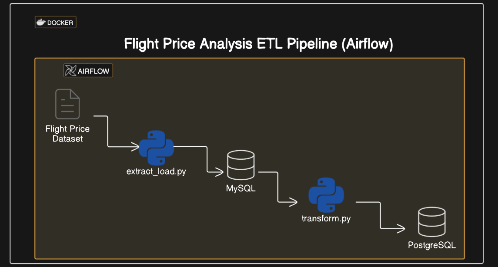
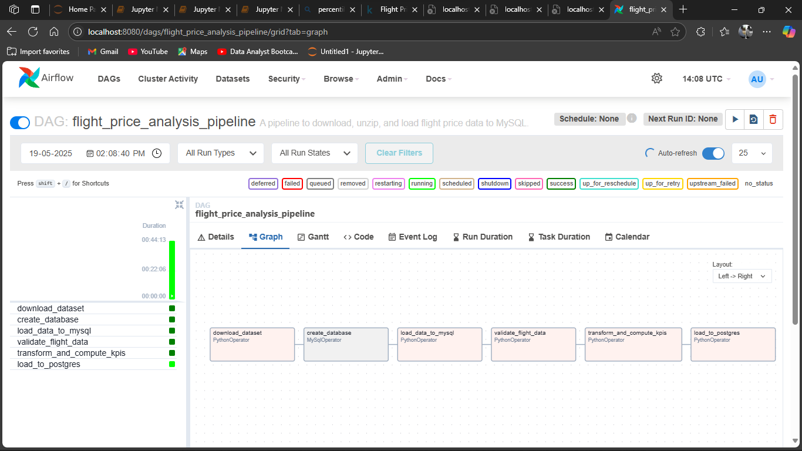

# Flight Price Analysis Pipeline

## Overview
A containerized data pipeline that processes and analyzes flight price data using Apache Airflow. The system automatically ingests flight pricing data, performs validation and transformation, and stores the results in a PostgreSQL database for analysis.

For a detailed project overview including architecture, challenges, and solutions, see [Project Overview](Project_overview.md).

## Architecture
- **Airflow**: Orchestrates the data pipeline
- **MySQL**: Staging database for raw data
- **PostgreSQL**: Analytics database for processed data
- **Docker**: Containerized deployment



## Project Structure
```
.
├── dags/                    # Airflow DAG definitions
│   └── flight_project_dag.py
├── data/                    # Data files
├── images/                  # Project images
├── mysql-config/           # MySQL configuration
├── mysql-init/             # MySQL initialization scripts
├── postgres-init/          # PostgreSQL initialization scripts
└── Docker-compose.yml      # Container orchestration
```



## Quick Start
1. Ensure Docker and Docker Compose are installed
2. Clone the repository
3. Start the services:
   ```bash
   docker-compose up -d
   ```
4. Access Airflow UI at `http://localhost:8080`
   - Username: admin
   - Password: admin

## Services
- **Airflow**: Available at port 8080
- **MySQL**: Available at port 3306
- **PostgreSQL**: Available at port 5432

## Development
- DAGs are located in the `dags/` directory
- Database initialization scripts are in `mysql-init/` and `postgres-init/`
- Configuration files are in `mysql-config/`

